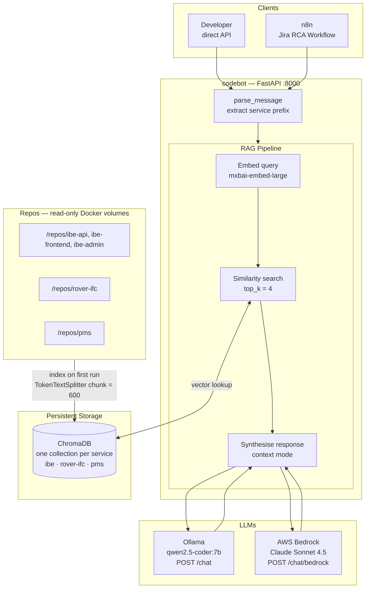
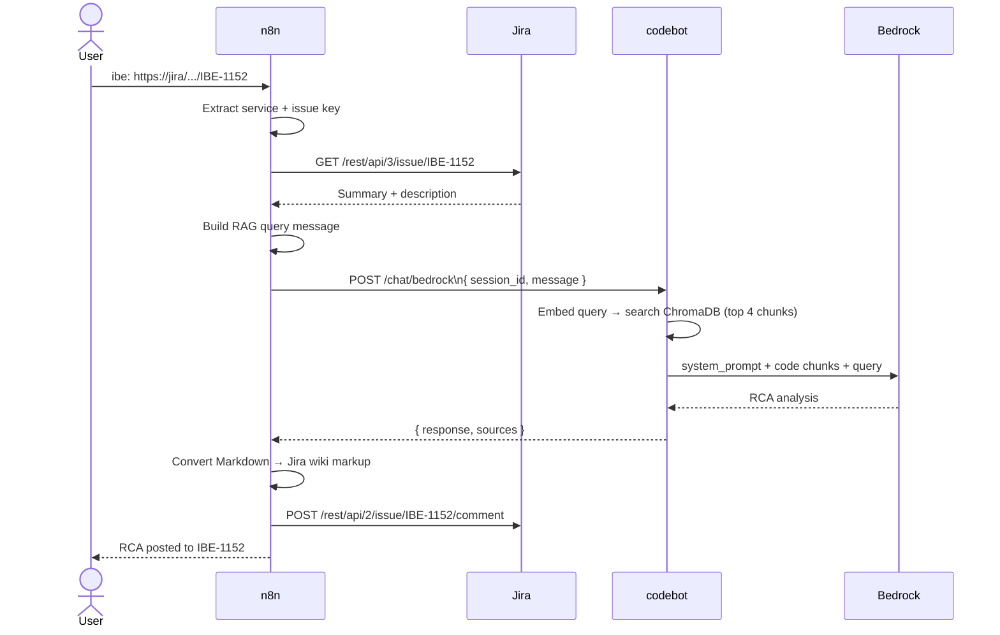

# codebot — Stayntouch Code Intelligence

> RAG-powered code assistant for Stayntouch repositories. Configure any set of repos as a named service, then ask questions across them using a simple chat prefix.

---

## Architecture



On first run, codebot indexes all configured repos (1–3 min per service depending on size). Subsequent starts load from disk in ~2 seconds.

---

## Jira RCA Workflow



Chat input format: `<service>:<jira_url_or_key>` — optionally followed by additional context on new lines.

```
ibe: https://stayntouch.atlassian.net/browse/IBE-1153
rover-ifc: CICO-126016
pms: CICO-133990
  Stack trace: NoMethodError at reservations_controller.rb:42
```

---

## Services Config (`services.yaml`)

```yaml
services:
  - name: ibe
    jira_project_key: IBE
    system_prompt: |
      You are an expert in the Stayntouch IBE application.
      IBE has three layers: ibe-api (LoopBack 4), ibe-frontend (Express/Jade), ibe-admin (Angular 19).
      When analysing bugs: identify the layer, trace the call chain, point to the exact file, suggest a fix.
    file_extensions: [.js, .jsx, .ts, .tsx]
    repos:
      - /repos/ibe-api
      - /repos/ibe-frontend
      - /repos/ibe-admin

  - name: rover-ifc
    jira_project_key: CICO
    system_prompt: |
      You are an expert in the Stayntouch Rover IFC application (Ruby on Rails 7).
      ...
    file_extensions: [.rb, .erb, .rake, .yml, .json]
    repos:
      - /repos/rover-ifc

  - name: pms
    system_prompt: |
      You are an expert in the Stayntouch Rover PMS application (Ruby on Rails 6.1).
      ...
    file_extensions: [.rb, .erb, .rake]
    repos:
      - /repos/pms
```

| Field | Description |
|-------|-------------|
| `name` | Used as the message prefix (`ibe:`, `pms:`) |
| `jira_project_key` | Maps a Jira project to this service (used by `GET /project/{key}`) |
| `system_prompt` | Expert context given to the LLM for this service |
| `file_extensions` | File types to index (defaults to `.js .jsx .ts .tsx`) |
| `repos` | Container paths of repos to index — must match volume mounts |

---

## Setup

### 1. Mount repos in `docker-compose.yml`

```yaml
volumes:
  - ./services.yaml:/app/services.yaml:ro
  - chroma_data:/app/chroma_db
  - ${REPO_ROOT}/ibe-api:/repos/ibe-api:ro
  - ${REPO_ROOT}/ibe-frontend:/repos/ibe-frontend:ro
  - ${REPO_ROOT}/ibe-admin:/repos/ibe-admin:ro
  - ${REPO_ROOT}/rover-ifc:/repos/rover-ifc:ro
  - ${REPO_ROOT}/pms:/repos/pms:ro
```

Set `REPO_ROOT` in `.env` to the parent directory containing your repos:

```
REPO_ROOT=/Users/you/Codebase
```

### 2. Configure `.env`

```
REPO_ROOT=/Users/you/Codebase

# AWS Bedrock (required for /chat/bedrock)
AWS_ACCESS_KEY_ID=AKIA...
AWS_SECRET_ACCESS_KEY=...
AWS_REGION=us-east-1
BEDROCK_MODEL_ID=global.anthropic.claude-sonnet-4-5-20250929-v1:0
```

### 3. Pull Ollama models (one-time, on host machine)

```bash
ollama pull qwen2.5-coder:7b   # local LLM
ollama pull mxbai-embed-large  # embedding model (used by both endpoints)
```

### 4. Start codebot

```bash
docker compose up --build
```

---

## API Endpoints

| Endpoint | Description |
|----------|-------------|
| `GET /services` | List configured service names |
| `GET /project/{key}` | Resolve a Jira project key to a service name |
| `POST /chat` | Chat using local Ollama (`qwen2.5-coder:7b`) |
| `POST /chat/bedrock` | Chat using AWS Bedrock (Claude Sonnet) |
| `DELETE /session/{id}` | Clear conversation history for a session |
| `POST /reindex` | Rebuild index for all services |
| `POST /reindex/{service}` | Rebuild index for one service only |

### Request / Response

```json
POST /chat/bedrock
{ "message": "ibe: why is checkout failing?", "session_id": "debug-1" }

→ { "response": "...", "sources": ["ibe-api/src/services/cart.service.ts"] }
```

Message format: `<service>: <question>` — the service prefix routes the query to the right index and system prompt.

Unknown or missing prefix returns `400` with the list of valid services.

### After pulling new code

```bash
# Reindex one service
curl -X POST http://localhost:8000/reindex/ibe

# Reindex all
curl -X POST http://localhost:8000/reindex
```

---

## n8n Setup

### Start n8n

```bash
docker run -it --rm --name n8n -p 5678:5678 \
  -v n8n_data:/home/node/.n8n \
  --add-host=host.docker.internal:host-gateway \
  docker.n8n.io/n8nio/n8n
```

Connect n8n to codebot's Docker network so it can reach `codebot:8000` by name:

```bash
docker network connect codebot_default n8n
```

### Import the Jira RCA workflow

Open `http://localhost:5678` → Workflows → Import from file → select `docs/n8n-jira-rca-chat-workflow.json` → activate → open the **Chat** panel.
